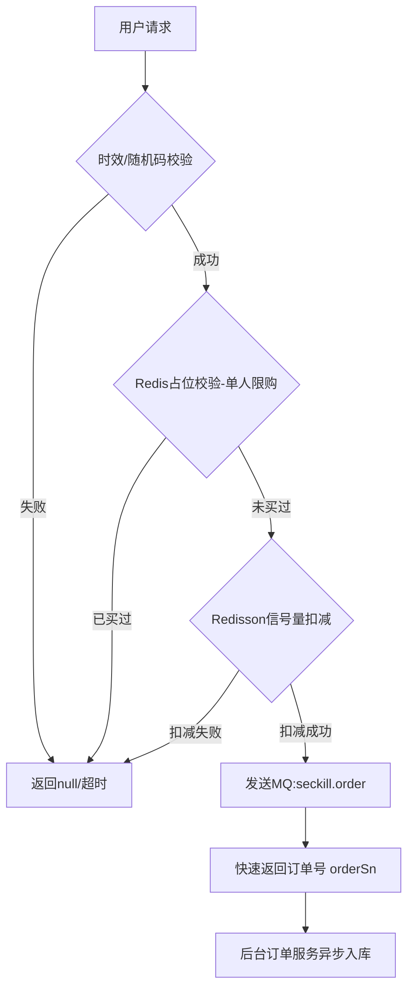

# 谷粒商城 (Gulimall) 核心架构与业务实现指南


## 🛠 技术栈与基础设施

| **技术组件**       | **核心用途**         | **关键特性**                                  |
| ------------------ | -------------------- | --------------------------------------------- |
| **Spring Session** | 分布式认证           | 解决跨子域 Session 共享，数据持久化至 Redis   |
| **Redisson**       | 分布式锁与信号量     | 看门狗机制、读写锁、秒杀信号量（Semaphore）   |
| **Elasticsearch**  | 核心检索与聚合       | 支持品牌、分类、属性的多维度嵌套聚合          |
| **RabbitMQ**       | 异步解耦与最终一致性 | 延时队列处理订单补偿、手动 ACK 保证消息不丢失 |
| **Sentinel**       | 流量治理             | 接口限流、熔断降级及自定义 UrlBlockHandler    |

------

## 🔐 认证与授权：分布式 Session 与 JWT

### 1. 跨子域 Session 共享

在微服务中，通过 `Spring Session + Redis` 重新定义 Cookie 序列化规则。

- **域名扩大**：设置 `DomainName("gulimall.com")`，实现 `auth.gulimall.com` 与 `order.gulimall.com` 的 Cookie 通用。

- **拦截器校验**：

  在拦截器中对 Token 进行合法性校验，通过 `AntPathMatcher` 放行无需登录的静态资源或特定接口。

### 2. 社交登录与安全

- **密码加密**：采用 **BCrypt** 强哈希算法。其底层通过随机加盐，即使数据库泄露，黑客也无法通过彩虹表反推明文。
- **OAuth2.0**：标准的“授权码模式”逻辑，通过回调获取令牌并持久化用户信息。

------

## 📦 商品与搜索：高并发下的检索优化

### 1. Elasticsearch 嵌套聚合解析

商品检索涉及复杂的“属性-规格”关联，ES 使用 `Nested` 类型存储 `attrs`。

- **解析逻辑**：遍历 `ParsedNested` 结果，先拆解 `attrIdAgg`，再从中提取 `attrNameAgg` 和 `attrValueAgg`。

- 聚合解析规律表：

  | 聚合场景 | 接收类 | 核心方法 |

  | :--- | :--- | :--- |

  | 字段分组 | ParsedLongTerms | getBuckets() 获取统计项 |

  | 嵌套聚合 | ParsedNested | getAggregations() 深入内层 |

### 2. 多级缓存一致性 (Cache-Aside Pattern)

- **DCL (Double Check Lock)**：在查询数据库前再次确认缓存，防止缓存击穿。

- **Redisson 看门狗 (WatchDog)**：

  解决业务执行时间长于锁过期时间的问题，只要业务未执行完，看门狗会每 10s 自动续期 30s。

- **非阻塞锁价值**：使用 `tryLock()` 失败时快速返回旧数据或抛出友好提示，避免线程大量堆积导致系统 OOM。

------

## 🏭 库存系统：分布式库存锁定逻辑

库存锁定不直接操作数据库事务，而是采用 **“工作单 + 延时消息”** 的最终一致性方案。

1. **锁定逻辑**：在 `wms_ware_sku` 表执行 `stock_locked` 累加，并在 `wms_ware_order_task_detail` 记录行锁详情。
2. **异步补偿机制**：
   - 锁定成功后发送 **延时消息**（如 30 分钟）。
   - **死信监听**：如果时间到期后，发现关联订单已取消或未支付，则根据工作单详情执行反向逻辑：`SET stock_locked = stock_locked - num`。

------

## ⚡ 高并发秒杀：基于信号量的流量拦截

秒杀模块核心在于 **“内存扣减、异步下单”**，彻底保护数据库。

### 1. 秒杀执行流程图




### 2. 关键设计点

- **随机码 (Random Code)**：商品 ID 拼接 UUID，只有秒杀开始时才从 Redis 暴露，防止抢跑脚本。

- **库存预热**：定时任务（Cron）每晚将未来 3 天的商品库存转化为 `RSemaphore` 存入 Redis。

- **RSemaphore tryAcquire**：

  ```java
  // 100ms 快速尝试，抢不到立即释放线程
  boolean acquire = semaphore.tryAcquire(num, 100, TimeUnit.MILLISECONDS);
  ```

------

### 2. 关键技术点

#### A. 随机码 (Random Code)

- 
- **目的**：防止恶意脚本在秒杀开始前扫描接口地址进行刷单。
- **实现**：秒杀开始时，才在 Redis 中暴露包含随机码的 Token，校验时需匹配 skuId + randomCode。

#### B. Redis 预热与数据结构

- 
- **秒杀场次**：List 结构，存储当前场次的商品 ID。
- **商品详情**：Hash 结构，Key 为 skuId，Value 为商品详细信息（含库存、限购量）。
- **库存信号量**：Redisson Semaphore，Key 为 seckill:stock:randomCode。

#### C. 信号量非阻塞扣减

使用 Redisson 的 RSemaphore 进行库存预扣，而非数据库操作。


## 💳 订单与支付：幂等性与可靠性

### 1. 防重令牌 (Token 机制)

提交订单前生成唯一 Token 存入 Redis。提交时利用 **Lua 脚本** 执行“校验+删除”原子操作，防止多次点击导致重复下单。

### 2. 消息可靠投递 (RabbitMQ ACK)

- **手动确认**：`channel.basicAck(deliveryTag, false)`。
- **失败处理**：如果业务处理异常，执行 `channel.basicReject(requeue=true)` 使其重试，或转入死信队列进行人工审计。

